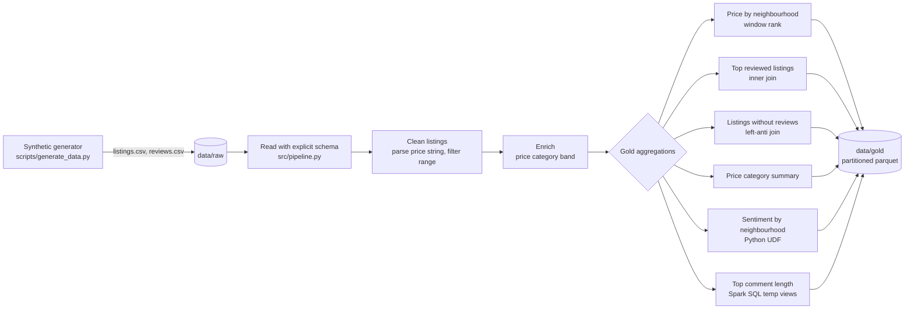

# PySpark Airbnb Analytics

A production-style PySpark batch analytics pipeline over Airbnb listings and reviews. It reads raw listings and reviews from CSV, cleans and enriches the data, and produces a set of gold-layer analytics tables written as partitioned parquet. The project is the applied version of the ZTM Data Engineering course section "Data Processing with Spark": it implements the same techniques the course exercises teach (reading Inside Airbnb data, cleaning the currency-formatted price field, aggregation functions, inner and left-anti joins, Spark SQL over temporary views, window functions, and Python UDFs) but wraps them in a config-driven, tested, runnable pipeline.

The pipeline ships with a synthetic data generator that produces Inside-Airbnb-shaped data, so it runs end to end with zero external downloads. Point it at the real London dataset instead by swapping the paths in the config.

## Architecture



## Tech stack

- PySpark 3.5.4 (DataFrame API, Spark SQL, window functions, UDFs)
- Python 3.11 with type hints and dataclass-based configuration
- pytest for transformation unit tests on a local SparkSession
- Parquet with snappy compression for the gold layer
- Java 21 (Temurin) as the Spark runtime

## Dataset

The pipeline works on two tables shaped like the Inside Airbnb London export used in the course.

Listings (one row per property):

- id, name, host_id, host_name
- neighbourhood_cleansed, room_type, property_type
- price (a currency string such as `$1,234.00` that the pipeline must parse)
- minimum_nights, number_of_reviews, reviews_per_month
- review_scores_rating, review_scores_location, first_review

Reviews (one row per review):

- listing_id, id, date, reviewer_id, reviewer_name, comments

The generator writes roughly 8,000 listings and 120,000 reviews by default, including listings with no reviews and a fraction of listings whose price fails to parse, so the cleaning stage has real work to do. The real course dataset can be fetched with the course script `02-data-processing-with-spark/data/download_data.sh`, which downloads the Inside Airbnb London CSV files over the network.

## What the pipeline demonstrates

- Explicit `StructType` schemas instead of inference, for stable, fast reads.
- Price cleaning with `regexp_replace` to strip `$` and `,` before casting to double, exactly the transformation the course teaches.
- A `when`/`otherwise` price-band expression plus a Python UDF for review sentiment scoring.
- Aggregations: average price and rating per neighbourhood, listing counts per price band, reviews per listing.
- An inner join for most-reviewed listings and a left-anti join to find listings that were never reviewed.
- A window function to rank neighbourhoods by average price.
- A Spark SQL query over `createOrReplaceTempView` to rank listings by average review comment length.
- Caching of the cleaned fact table, `repartition` before writing, and `partitionBy` on the price band.

## Run instructions

Use the shared virtual environment that already has PySpark 3.5.4 installed.

Set the Spark environment so the workers match the driver:

```sh
export JAVA_HOME=$(/usr/libexec/java_home)
export PYSPARK_PYTHON="/Users/joelnewton/Desktop/Data Engineering/.venv/bin/python"
export PYSPARK_DRIVER_PYTHON="/Users/joelnewton/Desktop/Data Engineering/.venv/bin/python"
```

Step 1, generate the data:

```sh
python scripts/generate_data.py --listings 8000 --reviews 120000
```

Step 2, run the pipeline:

```sh
python -m src.pipeline
```

Step 3, run the tests:

```sh
python -m pytest -q
```

Gold tables land under `data/gold/`. The cleaned listings fact is partitioned by price band, and each aggregation is written to its own subdirectory as parquet.

## Sample output

Average price by neighbourhood (top 5):

```
+----------------------+-------------+---------+---------+---------+----------+----------+
|neighbourhood_cleansed|listing_count|avg_price|min_price|max_price|avg_rating|price_rank|
+----------------------+-------------+---------+---------+---------+----------+----------+
|Kensington and Chelsea|543          |135.48   |20.99    |697.34   |4.27      |1         |
|Southwark             |568          |132.10   |22.70    |690.30   |4.27      |2         |
|Newham                |580          |130.11   |15.00    |569.00   |4.23      |3         |
|Camden                |583          |129.22   |20.25    |634.25   |4.28      |4         |
|Ealing                |562          |129.01   |19.74    |591.73   |4.25      |5         |
+----------------------+-------------+---------+---------+---------+----------+----------+
```

Listing count by price band:

```
+--------------+-------------+---------+----------+
|price_category|listing_count|avg_price|avg_rating|
+--------------+-------------+---------+----------+
|Mid-range     |4831         |93.03    |4.25      |
|Luxury        |2313         |231.62   |4.25      |
|Budget        |856          |39.55    |4.25      |
+--------------+-------------+---------+----------+
```

Average review sentiment by neighbourhood (top 5):

```
+----------------------+------------+-------------+
|neighbourhood_cleansed|review_count|avg_sentiment|
+----------------------+------------+-------------+
|Southwark             |8420        |0.716        |
|Lambeth               |8778        |0.713        |
|Ealing                |8433        |0.711        |
|Greenwich             |8586        |0.711        |
|Wandsworth            |8422        |0.706        |
+----------------------+------------+-------------+
```

## Project layout

```
pyspark-airbnb-analytics/
  scripts/generate_data.py     Synthetic Inside-Airbnb-shaped data generator
  src/config.py                Dataclass configuration, optional YAML overlay
  src/schema.py                Explicit listings and reviews schemas
  src/transforms.py            Pure DataFrame transformations
  src/pipeline.py              End-to-end job and CLI entrypoint
  tests/test_transforms.py     pytest unit tests on a local SparkSession
  requirements.txt
```

All glory to God! ✝️❤️
