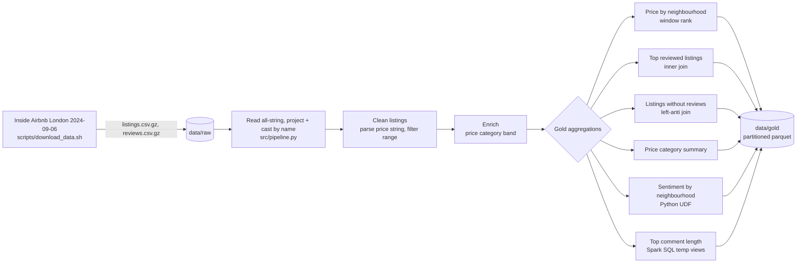

# PySpark Airbnb Analytics

A production-style PySpark batch analytics pipeline over the real Airbnb listings and reviews for London. It reads the raw listings and reviews CSVs, cleans and enriches the data, and produces a set of gold-layer analytics tables written as partitioned parquet. The project is the applied version of the ZTM Data Engineering course section "Data Processing with Spark": it implements the same techniques the course exercises teach (reading Inside Airbnb data, cleaning the currency-formatted price field, aggregation functions, inner and left-anti joins, Spark SQL over temporary views, window functions, and Python UDFs) but wraps them in a config-driven, tested, runnable pipeline.

It runs on the real Inside Airbnb London open dataset, the 2024-09-06 snapshot (the one the ZTM course uses), sourced from https://insideairbnb.com/get-the-data/. The raw files are large gzipped CSVs (about 96,000 listings and 1.9 million reviews) and are gitignored, so you download them once with `scripts/download_data.sh` before running the pipeline. A synthetic data generator is kept as an optional offline fallback for running without network access.

## Architecture



## Tech stack

- PySpark 3.5.4 (DataFrame API, Spark SQL, window functions, UDFs)
- Python 3.11 with type hints and dataclass-based configuration
- pytest for transformation unit tests on a local SparkSession
- Parquet with snappy compression for the gold layer
- Java 21 (Temurin) as the Spark runtime

## Dataset

The pipeline reads the real Inside Airbnb London open dataset, the 2024-09-06 snapshot, from https://insideairbnb.com/get-the-data/. The raw listings file is a wide CSV with roughly 75 columns whose text fields contain embedded newlines, commas, and quotes; the pipeline reads every column as a string with the header on (no inference scan) and then projects and casts only the fields it consumes, selecting by name so nothing misaligns.

Columns the pipeline consumes.

Listings (one row per property):

- id, name, host_id, host_name
- neighbourhood_cleansed, room_type, property_type
- price (a currency string such as `$1,200.00` that the pipeline must parse)
- minimum_nights, number_of_reviews, reviews_per_month
- review_scores_rating, review_scores_location, first_review

Reviews (one row per review):

- listing_id, id, date, reviewer_id, reviewer_name, comments

The real snapshot has about 96,000 listings and 1.9 million reviews. It includes listings with no reviews and listings whose price is missing or unparseable, so the cleaning stage has real work to do; after price parsing and the plausible-range filter, 63,184 listings remain.

Download the data (macOS ships `curl`, not `wget`):

```sh
bash scripts/download_data.sh
```

Or by hand:

```sh
mkdir -p data/raw
curl -L -o data/raw/listings.csv.gz https://data.insideairbnb.com/united-kingdom/england/london/2024-09-06/data/listings.csv.gz
curl -L -o data/raw/reviews.csv.gz  https://data.insideairbnb.com/united-kingdom/england/london/2024-09-06/data/reviews.csv.gz
```

The files are gitignored, so they are never committed. An optional synthetic generator, `scripts/generate_data.py`, writes the same-shaped gzipped files to `data/raw` for offline or demo runs when you have no network access.

## What the pipeline demonstrates

- Reading the wide, quote-and-newline-heavy Inside Airbnb CSVs with `multiLine`, `quote`, and `escape` options, then projecting and casting the consumed columns by name so a ~75-column source cannot misalign.
- Price cleaning with `regexp_replace` to strip `$` and `,` before casting to double, exactly the transformation the course teaches.
- A `when`/`otherwise` price-band expression plus a Python UDF for review sentiment scoring.
- Aggregations: average price and rating per neighbourhood, listing counts per price band, reviews per listing.
- An inner join for most-reviewed listings and a left-anti join to find listings that were never reviewed.
- A window function to rank neighbourhoods by average price.
- A Spark SQL query over `createOrReplaceTempView` to rank listings by average review comment length.
- Caching of the cleaned fact table, `repartition` before writing, and `partitionBy` on the price band.

## Run instructions

Use the shared virtual environment that already has PySpark 3.5.4 installed.

Set the Spark environment so the workers match the driver:

```sh
export JAVA_HOME=$(/usr/libexec/java_home)
export PYSPARK_PYTHON="/Users/joelnewton/Desktop/Data Engineering/.venv/bin/python"
export PYSPARK_DRIVER_PYTHON="/Users/joelnewton/Desktop/Data Engineering/.venv/bin/python"
```

Step 1, download the real data:

```sh
bash scripts/download_data.sh
```

(Offline fallback: `python scripts/generate_data.py --listings 8000 --reviews 120000` writes synthetic same-shaped gzipped files instead.)

Step 2, run the pipeline:

```sh
python -m src.pipeline
```

Step 3, run the tests:

```sh
python -m pytest -q
```

Gold tables land under `data/gold/`. The cleaned listings fact is partitioned by price band, and each aggregation is written to its own subdirectory as parquet.

## Sample output

Real results from the Inside Airbnb London 2024-09-06 snapshot. The raw source has about 96,182 listings and 1,887,519 reviews; after price parsing and the plausible-range filter, 63,184 listings remain across 33 neighbourhoods, of which 14,430 have never been reviewed.

Gold table row counts:

```
listings_clean: 63184 rows
price_by_neighbourhood: 33 rows
top_reviewed_listings: 20 rows
listings_without_reviews: 14430 rows
price_category_summary: 3 rows
sentiment_by_neighbourhood: 33 rows
top_comment_length: 20 rows
```

Average price by neighbourhood (top 5):

```
+----------------------+-------------+---------+---------+---------+----------+----------+
|neighbourhood_cleansed|listing_count|avg_price|min_price|max_price|avg_rating|price_rank|
+----------------------+-------------+---------+---------+---------+----------+----------+
|Westminster           |8074         |313.27   |19.0     |9680.0   |4.6       |1         |
|Kensington and Chelsea|4774         |309.67   |30.0     |8000.0   |4.65      |2         |
|City of London        |421          |268.85   |38.0     |5000.0   |4.53      |3         |
|Camden                |4322         |205.91   |12.0     |8000.0   |4.62      |4         |
|Hammersmith and Fulham|2659         |192.57   |25.0     |5000.0   |4.68      |5         |
+----------------------+-------------+---------+---------+---------+----------+----------+
```

Listing count by price band:

```
+--------------+-------------+---------+----------+
|price_category|listing_count|avg_price|avg_rating|
+--------------+-------------+---------+----------+
|Mid-range     |29562        |94.11    |4.66      |
|Luxury        |27634        |318.37   |4.68      |
|Budget        |5988         |39.41    |4.67      |
+--------------+-------------+---------+----------+
```

Average review sentiment by neighbourhood (top 5):

```
+----------------------+------------+-------------+
|neighbourhood_cleansed|review_count|avg_sentiment|
+----------------------+------------+-------------+
|Richmond upon Thames  |28780       |1.835        |
|Kingston upon Thames  |11561       |1.713        |
|Bromley               |11243       |1.656        |
|Wandsworth            |67338       |1.654        |
|Hammersmith and Fulham|67986       |1.635        |
+----------------------+------------+-------------+
```

## Project layout

```
pyspark-airbnb-analytics/
  scripts/download_data.sh     Download the real Inside Airbnb London dataset
  scripts/generate_data.py     Optional synthetic offline fallback generator
  src/config.py                Dataclass configuration, optional YAML overlay
  src/schema.py                Consumed-column projection and target types
  src/transforms.py            Pure DataFrame transformations
  src/pipeline.py              End-to-end job and CLI entrypoint
  tests/test_transforms.py     pytest unit tests on a local SparkSession
  requirements.txt
```

All glory to God! ✝️❤️
